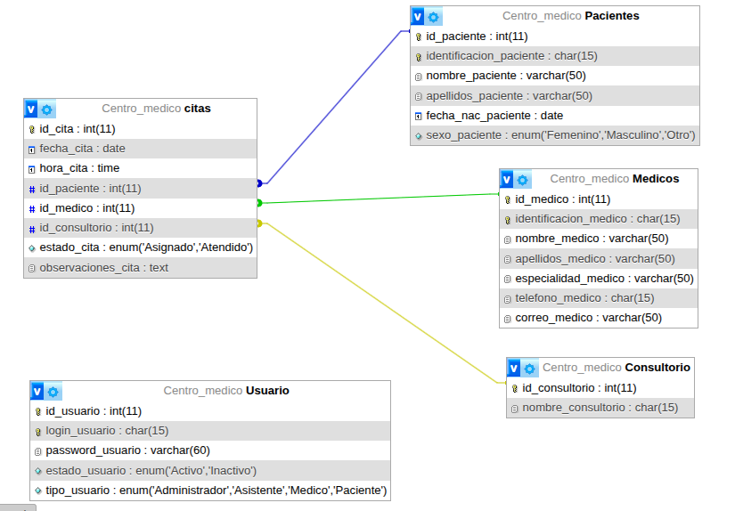

# Centro Médico SanaPlus

Este proyecto es una página para un centro médico que sirve para tener todo más ordenado y no andar en desorden con papeles.

Básicamente, ahí se guardan los datos de los pacientes y los médicos, y también se pueden agendar las citas sin enredos. Cada quien entra con su usuario (como admin, médico o paciente) y hace lo que le toca.

La idea es que todo sea más rápido y fácil, que no se pierda la info y que el centro médico funcione más juicioso, sin tanto complique.

## Modelo

